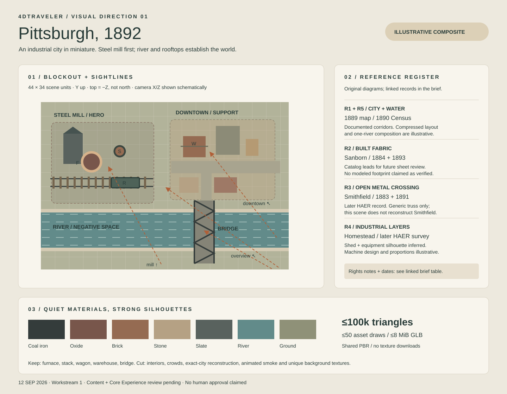

# Pittsburgh / 1892 — visual brief

Issue #7 · Workstream 1 · 12 September 2026

Build a warm, tactile industrial diorama. The **Steel Mill is the hero**: a furnace silhouette, its taller brick stack, and a freight wagon on readable rails. A compact brick city balances the right side; a blue-green river and open truss crossing provide foreground depth. This is an **illustrative composite of industrial Pittsburgh**, not a surveyed reconstruction of Homestead or an identified city block.

## Evidence and historical confidence

**Documented** means the cited record supports the limited claim in that row. **Inferred** means a general visual interpretation from that record, not an 1892 measurement. **Illustrative** means a deliberate art/composition choice without a claim of historical accuracy. A source's existence does not authenticate every feature of this scene. All URLs below were checked on 12 September 2026; some LOC item pages returned access errors while their catalog entries remained searchable.

| Ref | Primary reference / date                                                                                                                                                   | Supported use and confidence                                                                                                                                                                                                                                                                                                                                       | Rights / reuse note                                                                                                     |
| --- | -------------------------------------------------------------------------------------------------------------------------------------------------------------------------- | ------------------------------------------------------------------------------------------------------------------------------------------------------------------------------------------------------------------------------------------------------------------------------------------------------------------------------------------------------------------ | ----------------------------------------------------------------------------------------------------------------------- |
| R1  | [Map of Pittsburgh and Allegheny cities, University of Pittsburgh](https://historicpittsburgh.org/islandora/object/pitt%3ADARMAP0802), catalog date 1889; DARMAP0802       | **Documented:** the contemporary map records streets, railways and stations. **Inferred:** dense city fabric organized around transport corridors. Our straight river strip, compact distances and orientation are **illustrative**.                                                                                                                               | Repository says copyright not evaluated. Link only; no raster copied into the app or board.                             |
| R2  | [Sanborn Pittsburgh, volume 1](https://www.loc.gov/item/sanborn07911_001/), 1884; [volume 1](https://www.loc.gov/item/sanborn07911_003/), 1893                             | **Documented:** dated map sets exist on both sides of the target year. These are a future footprint/material research route, **not yet verified evidence for any modeled building**. Our warehouses and facade patterns remain **illustrative**.                                                                                                                   | No sheets redistributed. Confirm the specific sheet's rights and date before any future tracing or copying.             |
| R3  | [Smithfield Street Bridge, HAER PA-2](https://www.loc.gov/item/pa0073/), documentation compiled after 1968; structure 1883, expanded 1891                                  | **Documented:** the record identifies a double lenticular truss and 1883/1891 work. **Inferred:** an open metal truss gives a locally plausible crossing silhouette. Our simple braced, straight-chord crossing is **illustrative**, and must never be labeled Smithfield Street Bridge. Later photographs do not establish an 1892 paint color, deck or ornament. | LOC: government-made images have no known restrictions; copied images may differ. Link only; no reference image copied. |
| R4  | [Homestead Works, HAER PA-200, title sheet](https://www.loc.gov/resource/hhh.pa2223.sheet/?sp=1), modern survey of works established 1879; record includes later additions | **Documented:** industrial works at Homestead and their river setting. **Inferred:** a layered mill silhouette of sheds and tall equipment. Our furnace, pipe routing, stack courses and rail car are **illustrative**; later steelworks equipment is not evidence that it existed in 1892.                                                                        | HAER collection advisory applies per item; do not assume copied source drawings are unrestricted. Link only.            |
| R5  | [Map of the city of Pittsburg: population by ward, Eleventh Census](https://www2.census.gov/prod2/decennial/documents/1890a_v4p2-05.pdf), census year ending 31 May 1890   | **Documented:** river-separated wards in the contemporary city. **Inferred:** water strongly structures the overview. Our one-river tabletop omits the real confluence and is **illustrative**.                                                                                                                                                                    | U.S. government publication; no pages copied. Original plan drawing below is newly authored.                            |

No real mill name, company logo, numbered furnace, exact warehouse identity or claimed historical boat appears in this slice. The year supplies context, not a promise that every modeled machine is a measured 1892 artifact. The scene does not depict or imply an account of the Homestead strike. Historical prose and narration stay with Workstream 4.

## Scale, composition, and camera plan

One scene unit follows the existing meter convention, while relative building and district scales are intentionally compressed into a 44 × 34 unit tabletop. Y is up, ground is near Y=0, river runs along X at Z=9. The SVG is a scene-coordinate plan; its top is −Z, **not geographic north**. Preserve all stable object IDs, node names, existing selectable centers and camera data. Source imagery never overrides the agreed coordinates without a contract review.

| View           | Existing position → target  | Composition / keep-clear rule                                                                                                                                                                        |
| -------------- | --------------------------- | ---------------------------------------------------------------------------------------------------------------------------------------------------------------------------------------------------- |
| Overview       | `[30,32,38]` → `[0,0,0]`    | River crosses foreground, industrial verticals left, varied city roofs right. Keep stack taller than surrounding sheds; no foreground towers.                                                        |
| Steel Mill     | `[-1,12,15]` → `[-10,2,-3]` | Wagon low in foreground, furnace left rear, stack right rear. Place large shed behind/left of the selectable trio. No opaque smoke or pipe rack across object centers. Highest geometry detail here. |
| Downtown       | `[20,13,9]` → `[8,1.5,-6]`  | Warehouse front facade faces +Z, street separates it from low foreground row houses. Background skyline steps from 3 to 6 units; no building masks warehouse center.                                 |
| River / Bridge | `[20,13,24]` → `[7,0,9]`    | Water visible through open trusses, cross-bracing makes silhouette legible, low banks frame endpoints. Bridge center remains open/readable from this angle.                                          |

| POI bounds (X, Z)              | Fixed selectable centers (X, Y, Z)                             | Local height cap                     |
| ------------------------------ | -------------------------------------------------------------- | ------------------------------------ |
| Steel Mill: X −20…−2, Z −12…3  | `furnace [-13,2.5,-4]`; `stack [-8,4,-6]`; `rail-car [-7,1,0]` | Stack ≈8; furnace ≈5; rear shed ≈4.5 |
| Downtown: X 1…19, Z −13…2      | `warehouse [5,2,-8]`                                           | Hero warehouse ≈4; rear buildings ≤6 |
| River / Bridge: X 4…10, Z 3…15 | `bridge [7,1,9]`                                               | Deck ≈1; truss top ≈3; banks low     |

Named selectable groups contain the visible surfaces themselves. Merge their material batches only within each group. Do not substitute detached invisible hit boxes. Background meshes can merge globally by material. Keep the current primitive fallback intact until browser selection, highlighting and framing checks pass.

## Material and atmosphere direction

Use a shared, texture-free PBR palette for the first demo: coal iron `#343c3b`, oxidized iron `#78564b`, brick `#956b52`, sandstone `#b5a184`, slate `#59625e`, water `#628b8a`, ground `#8f9178`. These colors are **illustrative**, not sampled period paint. Keep metal subdued (metalness 0.45–0.7), masonry rough (roughness 0.85–1), and water broad/matte enough to avoid glitter. Varied geometry and material accents replace per-building oversized textures; introduce one shared atlas only if later visual review demonstrates a need.

Weather/time are **illustrative**: clear overcast-to-warm afternoon, soft directional shadows, pale warm background, mild depth haze. The first model contains no alpha smoke planes or animated water. Atmosphere belongs in the world renderer and must never obscure selectable objects. Quiet palette and geometric rhythm carry the scene before effects. Background windows are dark recess-like panels; chimney caps, cornices and roofs add readable relief. No glowing furnace, sparks or emissive night windows are required.

## Prioritized kit and budgets

| Priority                | Asset kit / reuse strategy                                                                          | Triangle allowance | Draw allowance |
| ----------------------- | --------------------------------------------------------------------------------------------------- | -----------------: | -------------: |
| P0                      | Hero furnace: tapered shell, collars, support legs, pipework, access deck; one named group          |             12,000 |              8 |
| P0                      | Tall brick stack: taper, bands, open cap; one named group                                           |              5,000 |              4 |
| P0                      | Freight wagon: open body, underframe, 4 wheels, ribs, couplers; one named group                     |              7,000 |              6 |
| P0                      | Terrain, two banks, river, rail ties/rails and streets; merge by shared material                    |             12,000 |             10 |
| P0                      | Warehouse: repeated bays, loading door, cornice, pitched roof; one named group                      |              7,000 |              6 |
| P0                      | Bridge: deck, repeated truss panels, cross ties, masonry piers; one named group                     |             10,000 |              5 |
| P1                      | Mill shed modules and service sheds, repeated roof ribs, low pipe supports                          |             12,000 |         Shared |
| P1                      | Two row-building families, facade/window/roof variants; repeated source geometry, merge by material |             15,000 |         Shared |
| P1                      | Coal piles, crates, barrels, bollards, lumber, a simple unselectable barge                          |             10,000 |         Shared |
| Reserve                 | Integration and silhouette adjustments                                                              |             10,000 |             11 |
| **Whole asset ceiling** | GLB ≤8 MiB, preferred ≤4 MiB; no external images, Draco or runtime decoder required                 |        **100,000** |         **50** |

Geometry draw counts exclude renderer shadow passes, UI/POI overlays and fallback. Record actual GLB bytes, triangles, material batches, texture count and required node names on export. Runtime total draw calls and frame timings are separately verified in #10. First demo targets are ≤150 total draw calls, ≤200,000 rendered triangles, and a usable stable view on a 390px-wide mobile viewport; frame-rate measurements must name the real test hardware/browser rather than claim a universal rate.

## Explicit cuts and review handoff

Do not model the full city, real topography/confluence, interiors, people, operating machinery, cable networks, signage, precise historical equipment, smoke simulation, dynamic water, or distant facade ornaments. Keep far buildings economical, reuse roofs/windows, and spend remaining geometry on the furnace/wagon/bridge silhouette. A boat is a low-detail optional P1 prop; drop it before compromising the hero or browser budget.

The source-backed framing and fixed camera table are ready for review. **Content owner review and Core Experience owner review remain pending; no human approval is claimed.** Content review should accept the composite label, inference boundaries, reference dates and absence of named reconstructions. Core Experience review should confirm the four fixed sightlines at desktop/mobile widths, repeated transitions, and marker clearance. Astra may review these handoffs as integration owner; only record reviewer names and decisions after actual feedback. Model work can proceed as a reversible implementation under the user's instruction, with these uncompleted human reviews visible in the PR.
